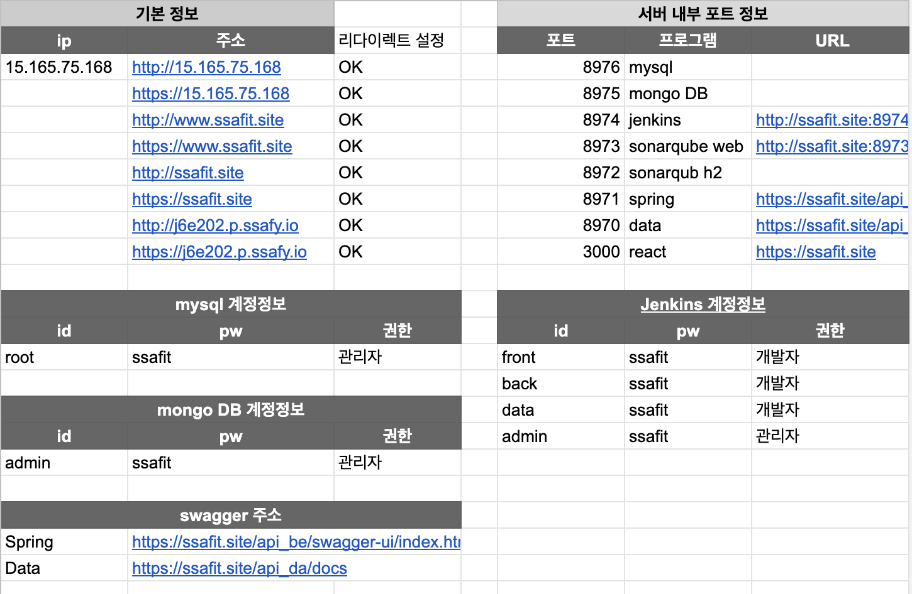
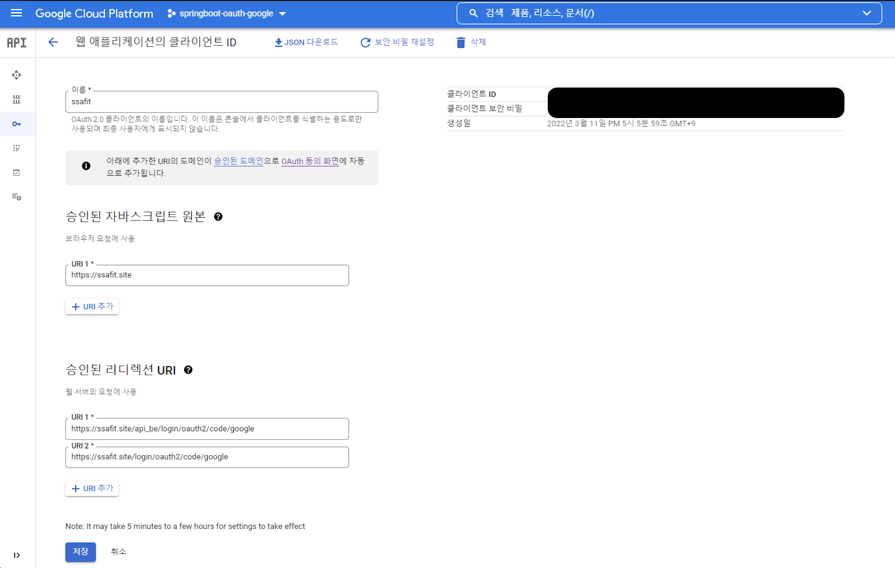
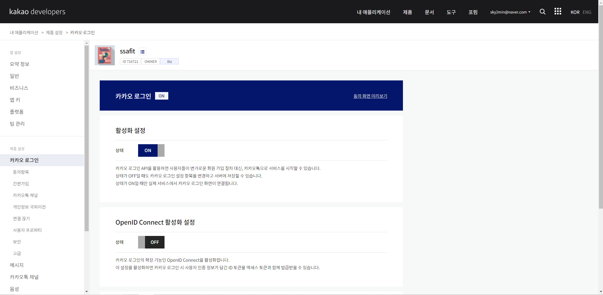
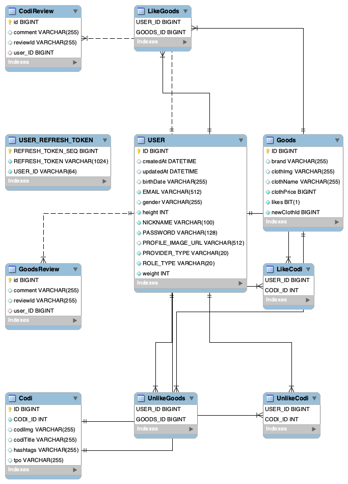
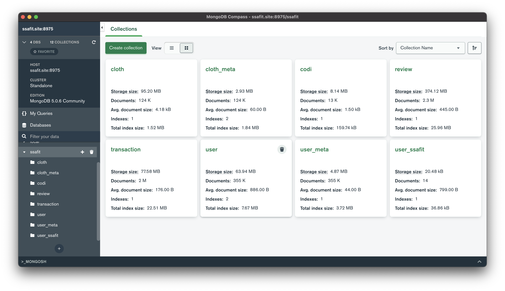

# E202 포팅 매뉴얼

## Index
0. 서버설정 정보
1. 배포 매뉴얼
	* Nginx 설정
	* Jenkins 파이프라인 설정
	* Docker 실행 방법

2. 외부 서비스
	* Google / kakao Login
	* 가비아 도메인

3. DB 덤프파일

4. 시연 시나리오 (GIF로 대체)

## 0. 서버설정 정보


## 1-1. Nginx 설정

### SSL 설정

```bash
# letsencrypt 설치하기
sudo apt-get update
sudo apt-get install letsencrypt

# 인증서 발급
# sudo letsencrypt certonly --standalone -d 도메인
sudo letsencrypt certonly --standalone -d ssafit.site

# 이메일 입력 및 안내 사항에 동의 후 진행

# root 계정 로그인
sudo su

# 인증서 위치 폴더 이동
cd /etc/letsencrypt/live/도메인

# pem을 PKCS12 형식으로 변경
# key 파일 비밀번호 입력
openssl pkcs12 -export -in fullchain.pem -inkey privkey.pem -out key.p12 -name airpageserver -CAfile chain.pem -caname root

# 인증서 복사
# 인증서 보관 폴더를 미리 생성해 주세요.
# sudo cp [파일이름] [인증서를 보관 할 docker volume 폴더] 
# 아래는 예시

sudo cp fullchain.pem /home/ubuntu/docker-volume/ssl
sudo cp privkey.pem /home/ubuntu/docker-volume/ssl
sudo cp key.p12 /home/ubuntu/docker-volume/ssl
```

### default.conf

```bash
# /etc/nginx/conf.d/default.conf

server {
  listen 80;
  listen [::]:80;
	
  # server_name 도메인;
  server_name ssafit.site www.ssafit.site;

  access_log /var/log/nginx/access.log;
  error_log /var/log/nginx/error.log;

  location / {
    alias /usr/share/nginx/html;
    try_files $uri $uri/ /index.html;
    return 307 https://ssafit.site$request_uri; # http 접속 시 https 로 자동 접속
  }
  
} 

server {
	listen 443 ssl;
	listen [::]:443 ssl;
	 
	# server_name 도메인;
	server_name ssafit.site www.ssafit.site;

	ssl_certificate /home/ubuntu/nginx-volume/ssl/fullchain.pem;
	ssl_certificate_key /home/ubuntu/nginx-volume/ssl/privkey.pem;

	#root /usr/share/nginx/html;
 	#index index.html;

	location / {
		#try_files $uri $uri/ /index.html;
		proxy_pass http://ssafit.site:3000;
		proxy_redirect off;
	}

	location ^~/api_be/{
		proxy_pass http://localhost:8971/;
	}

  location ^~/api_da/{
    proxy_pass http://localhost:8970/;
		proxy_connect_timeout 600;      
		proxy_send_timeout 600;      
    proxy_read_timeout 600;      
	  send_timeout 600;   
   }

}
```

### redirect.conf

```bash
# /etc/nginx/conf.d/redirect.conf

server{
   listen 80;
   server_name j6e202.p.ssafy.io 15.165.75.168;
   return 301 $scheme://ssafit.site$request_uri;
}

server{
   listen 443;
   server_name j6e202.p.ssafy.io 15.165.75.168;
   return 301 $scheme://ssafit.site$request_uri;
}
```

### nginx.conf

```bash
# /etc/nginx/nginx.conf

user www-data;
worker_processes auto;
pid /run/nginx.pid;
include /etc/nginx/modules-enabled/*.conf;

events {
	worker_connections 768;
	# multi_accept on;
}

http {

	##
	# Basic Settings
	##

	sendfile on;
	tcp_nopush on;
	tcp_nodelay on;
	keepalive_timeout 65;
	types_hash_max_size 2048;
	# server_tokens off;

	# server_names_hash_bucket_size 64;
	# server_name_in_redirect off;

	include /etc/nginx/mime.types;
	default_type application/octet-stream;

	##
	# SSL Settings
	##

	ssl_protocols TLSv1 TLSv1.1 TLSv1.2 TLSv1.3; # Dropping SSLv3, ref: POODLE
	ssl_prefer_server_ciphers on;

	##
	# Logging Settings
	##

	access_log /var/log/nginx/access.log;
	error_log /var/log/nginx/error.log;

	##
	# Gzip Settings
	##

	gzip on;

	# gzip_vary on;
	# gzip_proxied any;
	# gzip_comp_level 6;
	# gzip_buffers 16 8k;
	# gzip_http_version 1.1;
	# gzip_types text/plain text/css application/json application/javascript text/xml application/xml application/xml+rss text/javascript;

	##
	# Virtual Host Configs
	##

	include /etc/nginx/conf.d/*.conf;
	include /etc/nginx/sites-enabled/*;
}

#mail {
#	# See sample authentication script at:
#	# http://wiki.nginx.org/ImapAuthenticateWithApachePhpScript
# 
#	# auth_http localhost/auth.php;
#	# pop3_capabilities "TOP" "USER";
#	# imap_capabilities "IMAP4rev1" "UIDPLUS";
# 
#	server {
#		listen     localhost:110;
#		protocol   pop3;
#		proxy      on;
#	}
# 
#	server {
#		listen     localhost:143;
#		protocol   imap;
#		proxy      on;
#	}
#}
```


## 1-2. Jenkins 파이프라인

## React App

```groovy
pipeline {
    agent any
    stages {
        stage('Clone') {
            steps {
                // Get some code from a GitHub repository
               git branch: 'front', credentialsId: '4da4e44f-480f-4760-a0e5-785eea317e68', url: 'https://lab.ssafy.com/s06-bigdata-rec-sub2/S06P22E202.git'
            }
        }
        stage('React npm install'){
						steps {
                dir("./frontend"){
                    yarn command: 'install'                   
                }
            }
				}
        stage('React Build') {
            steps {
                dir("./frontend"){
										sh "rm -rf ./build"
                    yarn command: 'build'
                    sh "ls -al"
                }
            }
        }
        
        stage('Docker Build') {
            steps{
                sh "docker ps -f name=front -q | xargs -r docker container stop"
                sh "docker container ls -a -fname=front -q | xargs -r docker container rm"
                sh "docker build -t ssafit_front ./frontend"
            }
        }
        
        stage('Docker Run') {
            steps {
                sh "docker run -d -p 3000:3000 --name front ssafit_front:latest"
            }
        }
}
```

## Spring

```groovy
// Gradle Version 6.4

pipeline {
    agent any

    stages {
        stage('Clone') {
            steps {
                // Get some code from a GitHub repository
               git branch: 'back', credentialsId: '4da4e44f-480f-4760-a0e5-785eea317e68', url: 'https://lab.ssafy.com/s06-bigdata-rec-sub2/S06P22E202.git'
            }
        }
        
        stage('Gradle Build') {
            steps {
                dir("./backend/backend-java"){
                    sh "rm /var/jenkins_home/workspace/backend/backend/backend-java/build/libs/*"
                    sh "chmod +x ./gradlew"
                    sh "./gradlew clean build"
                    sh "ls -al /var/jenkins_home/workspace/backend/backend/backend-java/build/libs"
                }
            }
        }
        
        stage('Docker Build') {
            steps {
                sh "docker ps -f name=spring -q | xargs -r docker container stop"
                sh "docker container ls -a -fname=spring -q | xargs -r docker container rm"
                sh "docker build -t spring ./backend/backend-java"
            }
        }
        
        stage('Docker Run') {
            steps {
                sh "docker run --name spring -d -p 8971:8080 spring:latest"
            }
        }
        
    }
}
```

## FastAPI

```groovy
pipeline {
    agent any

    stages {
        stage('Clone') {
            steps {
                // Get some code from a GitHub repository
               git branch: 'dataanalysis', credentialsId: '4da4e44f-480f-4760-a0e5-785eea317e68', url: 'https://lab.ssafy.com/s06-bigdata-rec-sub2/S06P22E202.git'
            }
        }
        
        stage('Docker Build') {
            steps {
                sh "docker ps -f name=data -q | xargs -r docker container stop"
                sh "docker container ls -a -fname=data -q | xargs -r docker container rm"
                sh "docker build -t fastapi ./data"
            }
        }
        
        stage('Docker Run') {
            steps {
                 sh "docker run --name data -d -p 8970:8000 fastapi:latest"
            }
        }
       
    }
}
```

## 1-3. Docker 실행방법

```docker

# 1. Git Clone

# 2. cd git folder

# 3. build docker images
docker build -t ssafit_front ./frontend
docker build -t spring ./backend/backend-java
docker build -t fastapi ./data

# 4. run  docker images
docker run --name front -d -p 3000:3000 ssafit_front:latest
docker run --name spring -d -p 8971:8080 spring:latest
docker run --name data -d -p 8970:8000 fastapi:latest

```


### React DockerFile

```docker
FROM node:14.15.4

RUN npm install -g serve

RUN mkdir ./build
COPY ./build ./build

ENTRYPOINT ["serve", "-s", "build"]

# 포트번호 3000
```

### Spring DockerFile

```docker
# JDK8 base image
FROM openjdk:8-jdk

# Add Author info
LABEL maintainer="dudrl0944@gmail.com"

ARG JAR_FILE=./backend-java/build/libs/ssafy-web-project-1.0-SNAPSHOT.jar

# copy jar
COPY ${JAR_FILE} app.jar

# Timezone setting
ARG DEBIAN_FRONTEND=noninteractive
ENV TZ=Asia/Seoul
RUN apt-get install -y tzdata

# run
ENTRYPOINT ["java","-jar","app.jar"]
```

### Fast API DockerFile

```docker
FROM python:3.9

WORKDIR /

COPY ./requirements.txt /requirements.txt
COPY ./main.py /main.py
COPY ./app /app

RUN pip install --no-cache-dir --upgrade -r /requirements.txt

CMD ["uvicorn", "main:app", "--host", "0.0.0.0", "--port", "8000", "--root-path", "/api_da"]
```


## 2. 외부서비스 정리

### Google / kakao Login

구글 로그인 콘솔 


카카오 로그인 콘솔

### 가비아 도메인

가비아


## 3. DB 덤프파일 

* db_dump 폴더 확인

### mysql 


### Mongo DB



## 4. 시연 시나리오